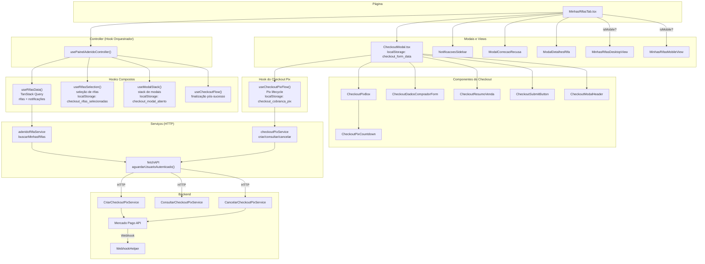

# Diagrama 1: Árvore de Componentes e Hooks

```mermaid
graph TD
    subgraph "Página"
        MinhasRifasTab["MinhasRifasTab.tsx"]
    end

    subgraph "Controller (Hook Orquestrador)"
        usePainelAderidoController["usePainelAderidoController()"]
    end

    subgraph "Hooks Compostos"
        useRifasData["useRifasData()<br/>TanStack Query<br/>rifas + notificações"]
        useRifasSelection["useRifasSelection()<br/>seleção de rifas<br/>localStorage: checkout_rifas_selecionadas"]
        useModalStack["useModalStack()<br/>stack de modais<br/>localStorage: checkout_modal_aberto"]
        useCheckoutFlow["useCheckoutFlow()<br/>finalização pós-sucesso"]
    end

    subgraph "Modais e Views"
        CheckoutModal["CheckoutModal.tsx<br/>localStorage: checkout_form_data"]
        DesktopView["MinhasRifasDesktopView"]
        MobileView["MinhasRifasMobileView"]
        NotificacoesSidebar["NotificacoesSidebar"]
        ModalCorrecao["ModalCorrecaoRecusa"]
        ModalDetalhes["ModalDetalhesRifa"]
    end

    subgraph "Hook do Checkout Pix"
        useCheckoutPixFlow["useCheckoutPixFlow()<br/>Pix lifecycle<br/>localStorage: checkout_cobranca_pix"]
    end

    subgraph "Componentes do Checkout"
        CheckoutPixBox["CheckoutPixBox"]
        CheckoutForm["CheckoutDadosCompradorForm"]
        CheckoutResumo["CheckoutResumoVenda"]
        CheckoutSubmit["CheckoutSubmitButton"]
        CheckoutHeader["CheckoutModalHeader"]
        PixCountdown["CheckoutPixCountdown"]
    end

    subgraph "Serviços (HTTP)"
        checkoutPixService["checkoutPixService<br/>criar/consultar/cancelar"]
        aderidoRifaService["aderidoRifaService<br/>buscarMinhasRifas"]
        fetchAPI["fetchAPI<br/>aguardarUsuarioAutenticado()"]
    end

    subgraph "Backend"
        CriarPix["CriarCheckoutPixService"]
        ConsultarPix["ConsultarCheckoutPixService"]
        CancelarPix["CancelarCheckoutPixService"]
        Webhook["WebhookHelper"]
        MercadoPago["Mercado Pago API"]
    end

    %% Conexões da página
    MinhasRifasTab --> usePainelAderidoController
    MinhasRifasTab --> CheckoutModal
    MinhasRifasTab --> NotificacoesSidebar
    MinhasRifasTab --> ModalCorrecao
    MinhasRifasTab --> ModalDetalhes
    MinhasRifasTab -->|isMobile?| DesktopView
    MinhasRifasTab -->|isMobile?| MobileView

    %% Controller compõe hooks
    usePainelAderidoController --> useRifasData
    usePainelAderidoController --> useRifasSelection
    usePainelAderidoController --> useModalStack
    usePainelAderidoController --> useCheckoutFlow

    %% CheckoutModal usa hook Pix
    CheckoutModal --> useCheckoutPixFlow

    %% CheckoutModal renderiza componentes
    CheckoutModal --> CheckoutPixBox
    CheckoutModal --> CheckoutForm
    CheckoutModal --> CheckoutResumo
    CheckoutModal --> CheckoutSubmit
    CheckoutModal --> CheckoutHeader
    CheckoutPixBox --> PixCountdown

    %% Serviços
    useCheckoutPixFlow --> checkoutPixService
    useRifasData --> aderidoRifaService
    checkoutPixService --> fetchAPI
    aderidoRifaService --> fetchAPI

    %% Backend
    fetchAPI -->|HTTP| CriarPix
    fetchAPI -->|HTTP| ConsultarPix
    fetchAPI -->|HTTP| CancelarPix
    MercadoPago -->|Webhook| Webhook
    CriarPix --> MercadoPago
    CancelarPix --> MercadoPago
```
