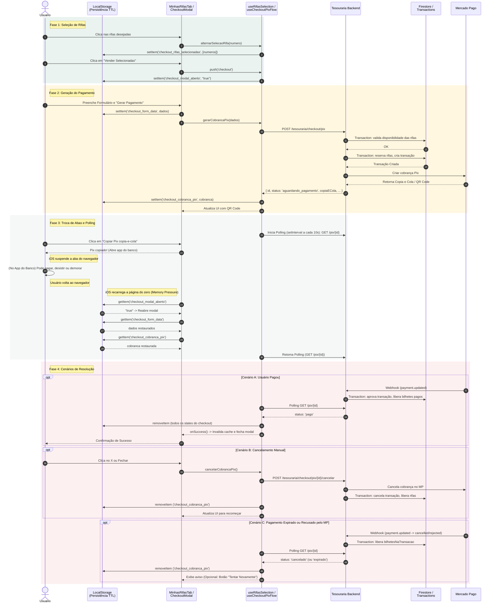

# Diagrama 2: Fluxo Completo de Checkout Pix

Este diagrama ilustra o ciclo de vida completo de uma reserva e pagamento Pix, cobrindo a jornada ideal, cancelamentos manuais, e o comportamento do sistema quando o app é suspenso (ex: troca de abas para ir ao app do banco).

